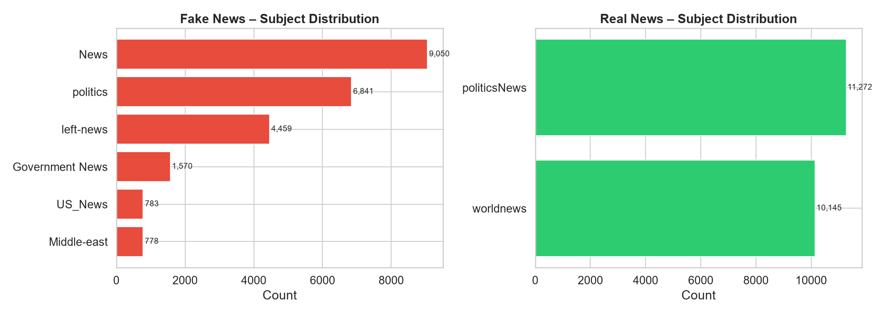
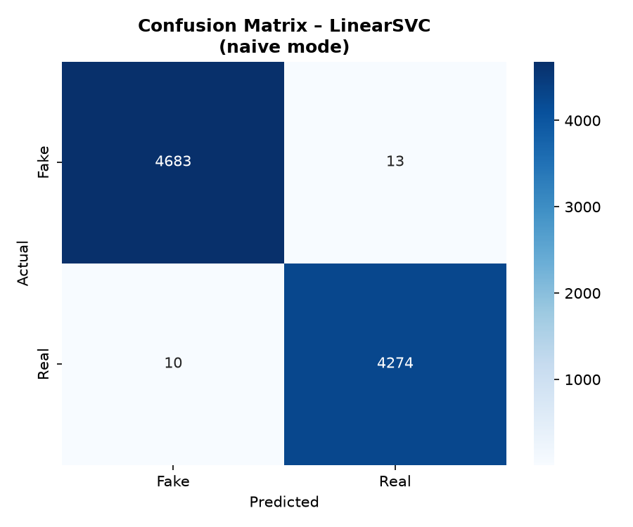
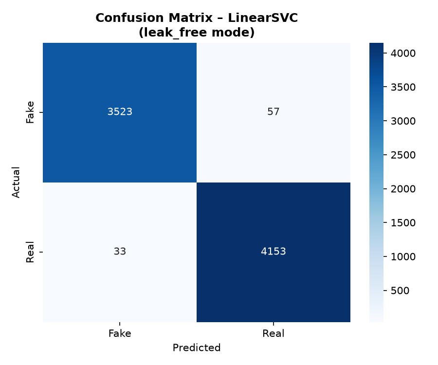
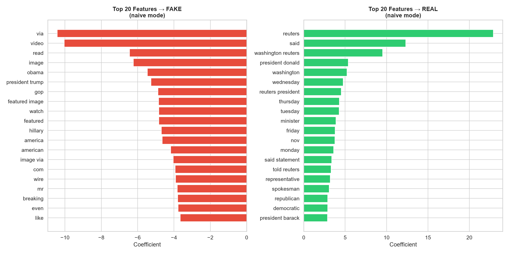
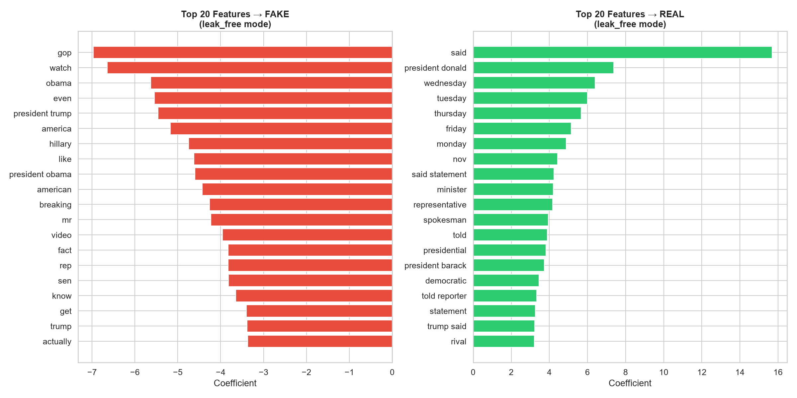
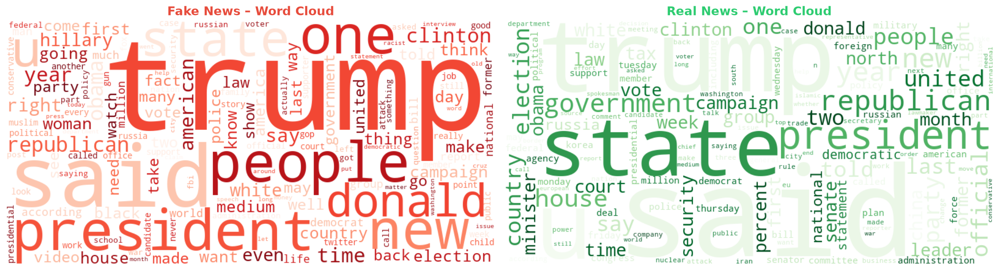

# Fake News Detection: Exposing and Fixing Data Leakage

[](LICENSE)

Binary classification of news articles (fake vs. real) on the Kaggle **Fake and Real News Dataset**, using TF-IDF with Logistic Regression, LinearSVC and Multinomial Naive Bayes.

On this dataset, simple classifiers usually report more than 99% accuracy. Most of that comes from **shortcuts**: signs of which website an article came from, not whether it is true. This project trains every model twice:

- **naive**: title + text with standard NLP preprocessing only.
- **leak_free**: known source artifacts removed, cross-class and exact duplicates dropped **before** the train/test split, and `subject`/`date` never used.

It then reports honestly what is left.

---

## Contents
- [Key results](#key-results)
- [Dataset & setup](#dataset--setup)
- [The leaks](#the-leaks)
- [Methodology](#methodology)
- [Results](#results)
- [Shortcut test](#shortcut-test)
- [Top features: before and after cleaning](#top-features-before-and-after-cleaning)
- [What the model actually learns](#what-the-model-actually-learns)
- [Extra analysis: style stress test](#extra-analysis-style-stress-test)
- [Word clouds](#word-clouds)
- [Error analysis](#error-analysis)
- [Pitfalls found during the project](#pitfalls-found-during-the-project)
- [Limitations](#limitations)
- [How to run](#how-to-run)
- [Interactive demo](#interactive-demo)
- [Project structure](#project-structure)

---

## Key results

| | naive | leak_free |
|---|---|---|
| Best model (LinearSVC), test accuracy | 0.9974 | **0.9884** |
| Logistic Regression, test accuracy | 0.9921 | **0.9790** |
| Shortcut test: LR on the **first 50 characters of the article body** | 0.9971 | **0.9000** |

- The naive model can almost perfectly identify an article from its first 50 characters, where the `CITY (Reuters) -` dateline sits.
- Removing the artifacts lowers every score, but leak_free accuracy stays around 98%. What remains is mostly the difference in **writing style between Reuters and partisan blogs**, not a signal of truthfulness (see [What the model actually learns](#what-the-model-actually-learns)).

---

## Dataset & setup

- **Source:** [Kaggle: Fake and Real News Dataset](https://www.kaggle.com/datasets/clmentbisaillon/fake-and-real-news-dataset) (Clément Bisaillon).
- **Content:** 44,898 articles from 2016–2017: 23,481 fake (`Fake.csv`) and 21,417 real (`True.csv`). Columns: `title`, `text`, `subject`, `date`.
- **Download:** get the ZIP from the Kaggle page (a free account is needed), or use the Kaggle CLI: `kaggle datasets download -d clmentbisaillon/fake-and-real-news-dataset`. Unzip it and put both CSVs in `data/`:

```text
fake-news-detection/
└── data/
    ├── Fake.csv
    └── True.csv
```

`.gitignore` excludes the raw and cleaned CSVs (`data/*.csv`), the saved splits (`data/*.npz`) and `models/`, so no data or trained models are committed.

---

## The leaks

EDA ([`results/eda_summary.md`](results/eda_summary.md)) found:

| Leak | Fake | Real |
|---|---|---|
| `(Reuters)` in the first 200 characters of the text | 0.0% | 99.1% |
| Body starts with a `LOCATION (Reuters) -` dateline | 0% | ~85% |
| `subject` column | News, politics, left-news, Government News, US_News, Middle-east | politicsNews, worldnews (no overlap) |
| Title tags like `(VIDEO)`, `[TWEETS]`, `(IMAGES)` | 37.4% | 0.0% |
| `Featured image …` credit | 34.8% | 0.0% |
| The word `via` | 47.7% | 2.2% |
| Twitter handles (`@user`) | 26.1% | 1.3% |
| `Getty Images` | 16.8% | 0.0% |
| `pic.twitter.com` | 14.8% | 0.0% |
| URLs | 14.1% | 0.0% |
| "Read more" | 11.2% | 0.0% |
| `21st Century Wire` | 5.3% | 0.0% |

Fake.csv also has 630 empty texts and 6,026 duplicated texts (Real: 1 and 225).



---

## Methodology

1. **Cleaning** ([`src/clean.py`](src/clean.py)):
   - *naive*: `title + text` → lowercase → keep letters only → remove NLTK English stopwords → WordNet lemmatization.
   - *leak_free*: the title and text are cleaned **separately** to remove:
     - the Reuters dateline and the word "reuters"
     - `21st Century Wire`
     - image/photo credits (`Featured image via …`, `Photo by …`), Getty/Flickr/YouTube/"screen capture" mentions
     - embedded tweet signatures (`— Name (@handle) Month d, yyyy`), Twitter handles, `pic.twitter.com` links and URLs
     - title tags like `(VIDEO)`, "Read more", `via`, and "ADVERTISEMENT"

     The same standard preprocessing follows. Empty texts are dropped, then texts that appear in both classes, then exact duplicates. This happens on the whole dataset **before** the split, leaving 38,826 articles.
   - `subject` and `date` are never used as features.
2. **Split:** stratified 80/20 train/test, seed 42. In leak_free mode, **0 test articles also appear in train**. In naive mode (no deduplication), **1,917 of 8,980 test articles are exact copies of training articles**, so the naive scores are inflated.
3. **Features:** TF-IDF on unigrams and bigrams (`max_features=50,000`, `min_df=3`, `max_df=0.95`, `sublinear_tf=True`). It is fit **inside an sklearn `Pipeline`**, so it only ever sees training data, including inside each CV fold.
4. **Models:** Logistic Regression (C=1), LinearSVC (C=1) and Multinomial NB (α=0.1).
5. **Evaluation:** 5-fold stratified CV (macro F1) on the training set, plus accuracy, precision, recall and macro F1 on the held-out test set.

---

## Results

Held-out test set; precision, recall and F1 are macro averages. Source: [`results/metrics_table.md`](results/metrics_table.md).

| Mode | Model | CV F1 (mean ± std) | Accuracy | Precision | Recall | F1 |
|---|---|---|---|---|---|---|
| naive | Logistic Regression | 0.9924 ± 0.0009 | 0.9921 | 0.9920 | 0.9922 | 0.9921 |
| naive | LinearSVC | 0.9972 ± 0.0003 | 0.9974 | 0.9974 | 0.9974 | 0.9974 |
| naive | Multinomial NB | 0.9647 ± 0.0019 | 0.9661 | 0.9661 | 0.9660 | 0.9661 |
| **leak_free** | Logistic Regression | 0.9804 ± 0.0014 | **0.9790** | 0.9794 | 0.9784 | **0.9789** |
| **leak_free** | **LinearSVC (best, used in demo)** | 0.9878 ± 0.0008 | **0.9884** | 0.9886 | 0.9881 | **0.9883** |
| **leak_free** | Multinomial NB | 0.9519 ± 0.0030 | **0.9524** | 0.9518 | 0.9524 | **0.9521** |

Naive test sets: 8,980 articles. Leak_free test sets: 7,766 articles.

Per-class results for leak_free LinearSVC: Fake P=0.9907, R=0.9841, F1=0.9874; Real P=0.9865, R=0.9921, F1=0.9893.

| naive: LinearSVC | leak_free: LinearSVC |
|---|---|
|  |  |

---

## Shortcut test

[`src/shortcut_test.py`](src/shortcut_test.py) trains Logistic Regression on **only the first 50 characters** of each article.

| Variant | naive | leak_free |
|---|---|---|
| **Body**: first 50 characters of the article text (main test) | acc 0.9971 / F1 0.9971 | acc **0.9000** / F1 **0.8990** |
| Title + text: first 50 characters of the cleaned training text | acc 0.9295 / F1 0.9294 | acc 0.9184 / F1 0.9177 |

- **Body test:** in naive mode, `reuters` has a coefficient of **+47.7**, followed by dateline cities (`washington`, `london`, `moscow`, `berlin`), so 50 characters are enough for 99.7% accuracy. With the dateline removed, the score drops by 9.7 points.
- **Title + text test:** these 50 characters are mostly the headline. Headline style (`watch`, `breaking`, `gop`, `hillary` for fake; `factbox`, `say`, `urge`, `seek` for real) is not an artifact, so cleaning barely changes this score. Headline style alone gets about 92%.

---

## Top features: before and after cleaning

Logistic Regression coefficients (negative → FAKE, positive → REAL). Source: [`src/explain.py`](src/explain.py).

| # | naive → FAKE | leak_free → FAKE | naive → REAL | leak_free → REAL |
|---|---|---|---|---|
| 1 | `via` (−10.43) | `gop` (−6.97) | **`reuters` (+22.88)** | `said` (+15.69) |
| 2 | `video` (−10.04) | `watch` (−6.64) | `said` (+12.32) | `president donald` (+7.37) |
| 3 | `read` (−6.44) | `obama` (−5.63) | **`washington reuters` (+9.53)** | `wednesday` (+6.40) |
| 4 | `image` (−6.24) | `even` (−5.55) | `president donald` (+5.37) | `tuesday` (+5.99) |
| 5 | `obama` (−5.46) | `president trump` (−5.46) | `washington` (+5.23) | `thursday` (+5.67) |
| 6 | `president trump` (−5.26) | `america` (−5.17) | `wednesday` (+4.75) | `friday` (+5.14) |
| 7 | `gop` (−4.88) | `hillary` (−4.75) | **`reuters president` (+4.53)** | `monday` (+4.88) |
| 8 | **`featured image` (−4.84)** | `like` (−4.62) | `thursday` (+4.30) | `nov` (+4.42) |
| 9 | `watch` (−4.83) | `president obama` (−4.60) | `tuesday` (+4.28) | `said statement` (+4.24) |
| 10 | **`featured` (−4.83)** | `american` (−4.43) | `minister` (+3.89) | `minister` (+4.20) |

Before cleaning, the top features are artifacts: `reuters`, the dateline, `via`, `image`, `featured image`, and `read` (from "Read more"). After cleaning, none of these remain.

| naive | leak_free |
|---|---|
|  |  |

---

## What the model actually learns

After the artifacts are removed, the model still scores about 98%. The top features show why: it is recognising **which kind of outlet wrote the article**, not whether the claims are true.

- **Real (all from Reuters):** wire-service conventions. Attribution verbs (`said`, `told reporters`, `said in a statement`), weekday dating (`on Wednesday`), abbreviated months (`Nov.`), formal titles (`President Donald Trump`, `President Barack Obama`), and roles such as `minister`, `spokesman`, `representative`.
- **Fake (partisan and alternative blogs):** informal and opinionated language. `GOP`, `Hillary`, `Obama` without a title, `America`, `even`, `like`, `actually`, `know`, `watch`, `breaking`, and abbreviations such as `Rep.` and `Sen.`

So the classifier is a good **source/style detector for this corpus**. A true article written in blog style would probably be called fake, and a false claim written in Reuters style would probably be called real. It checks no facts.

---

## Extra analysis: style stress test

*This is a side experiment, not the main result.* [`src/style_stress_test.py`](src/style_stress_test.py) takes the leak_free text and also removes common Reuters style markers:

- `said`, `say`, `saying`, `told`, `tell`, `reporter`
- `spokesman`, `spokeswoman`, `spokesperson`, `statement`
- weekday names
- the abbreviated months `jan`, `feb`, `aug`, `sept`, `oct`, `nov`, `dec`

It then retrains Logistic Regression with the same split and settings.

| Variant | Accuracy | F1 (macro) |
|---|---|---|
| leak_free (main) | 0.9790 | 0.9789 |
| leak_free + style markers removed | 0.9751 | 0.9750 |

Top features after removal:
- **→ FAKE:** `gop`, `watch`, `even`, `president trump`, `obama`, `america`, `hillary`, `president obama`, `like`, `breaking`
- **→ REAL:** `president donald`, `representative`, `minister`, `president barack`, `presidential`, `democratic`, `comment`, `president`, `rival`, `republican presidential`

Removing the most obvious markers costs only 0.4 points. The style difference runs through the whole vocabulary: how people are named, formal vs. informal words, and topic choice. Removing a list of words cannot take it out. See [`results/style_stress_test.md`](results/style_stress_test.md).

---

## Word clouds

Made from the leak_free text ([`src/wordclouds.py`](src/wordclouds.py)).



Both classes are dominated by the same topic words (`trump`, `said`, `president`, `state`, `people`). Word clouds show frequency, not discriminative power. Fake articles lean toward `hillary`, `clinton`, `obama`, `american`, `people` and `video`; real articles toward `government`, `republican`, `minister`, `election`, `court` and `security`. The coefficient charts above are the better view of what separates the classes.

---

## Error analysis

The best leak_free model (LinearSVC) misclassifies **90 of 7,766** test articles (1.16%). Full samples are in [`results/error_analysis.md`](results/error_analysis.md). Confidence below is the sigmoid of the SVM margin, not a calibrated probability.

Patterns:
- **Fake articles that copy news-wire style are called real.** Several misclassified fake articles quote or rewrite mainstream reporting (NBC News, AP). One even contains an AP dateline: `NEW YORK (AP) — New York City plans…`. With the newsy wording, the style detector has little to go on.
- **Real articles about tabloid-like topics are called fake.** For example, a Reuters story about Obama's half-brother backing Trump.
- **Most errors are close calls** (predicted confidence 50–61% in the samples), which fits a model that separates two writing styles and is unsure when an article mixes them.

---

## Pitfalls found during the project

Bugs found and fixed while auditing the first version of the pipeline:

1. **The Reuters dateline was never removed.** The regex was anchored to the start of the line (`^`), but it ran on `title + " " + text`, so the dateline was never at the start. `WASHINGTON () -` was left in about 85% of real articles, and `washington` stayed a top "real" feature. *Fix:* clean title and text separately and remove the anchor.
2. **Image credits were only partly removed.** The regex required a trailing period, but `Featured image via Getty Images` usually ends the article without one. `featured image` and `image via` stayed top "fake" features. *Fix:* the trailing period is now optional.
3. **Fake-only artifacts were missing from the cleaning list:** title tags like `(VIDEO)`, `via`, "Read more", "screen capture", Flickr/YouTube, and embedded tweet signatures. *Fix:* added patterns for each.
4. **The cross-class duplicate filter never ran.** It came after `drop_duplicates`, which already kept only one copy of each text, so it always removed 0 rows. *Fix:* it now runs before deduplication. On this data it still finds 0 conflicting duplicates, but the check now actually works.
5. **The shortcut test looked at the wrong 50 characters.** It used title + text, so the 50 characters were mostly the headline and never reached the dateline: naive 0.9295 vs. leak_free 0.9235, with no visible effect. *Fix:* the main test now uses the article body, and the title-based variant is kept as a secondary row.
6. **The demo had its own copy of the cleaning regexes**, which had already drifted from the training code. *Fix:* [`app/app.py`](app/app.py) now imports the cleaning function from `src/clean.py`.
7. **The demo crashed on empty input.** `predict` returned 3 values for an interface with 2 outputs. *Fix:* it now returns 2.
8. **The saved train/test splits (`data/*.npz`, about 67 MB each) were not git-ignored.** *Fix:* added to `.gitignore`.
9. **`scipy` was missing from `requirements.txt`**, although `app.py` and `explain.py` import it. *Fix:* added.

With the old cleaning, leak_free LinearSVC scored 0.9928. After the fixes it scores 0.9884, and Logistic Regression drops from 0.9844 to 0.9790.

---

## Limitations

- **One source per class.** Every real article is from Reuters, and every fake article is from a small set of partisan sites. The task therefore mixes up "fake vs. real" with "Reuters vs. blogs", and scores will not carry over to other outlets.
- **Style, not veracity.** No external knowledge or fact-checking is involved.
- **Time and topic.** The articles are US politics from 2016–2017. Names and events (`trump`, `hillary`, `obama`) are strong features that will age badly.
- **Cleaning is regex-based.** Some artifacts may still get through. Known ones:
  - 412 real titles start with `Factbox:`, a Reuters format that never appears in fake titles.
  - `video` appears in 21% of fake bodies vs. 3% of real ones, as a content word ("watch the video").
- **Naive scores are inflated** by 1,917 duplicated train/test articles.
- **Demo confidence** for LinearSVC is a sigmoid of the margin, not a calibrated probability.

---

## How to run

Tested with Python 3.14 (Anaconda `base` env) on Windows.

```bash
pip install -r requirements.txt
python -c "import nltk; nltk.download('stopwords'); nltk.download('wordnet')"
python run_all.py
```

`run_all.py` runs the stages in order (about 13 minutes on a laptop):

| Stage | Script | Output |
|---|---|---|
| EDA | `src/eda.py` | `results/eda_summary.md`, EDA figures |
| Cleaning | `src/clean.py` | `data/cleaned_naive.csv`, `data/cleaned_leak_free.csv` |
| Shortcut test | `src/shortcut_test.py` | `results/shortcut_test_results.md/.json` |
| Training | `src/train.py` | `results/metrics.json`, `results/metrics_table.md`, confusion matrices, `models/best_model.joblib` |
| Explainability | `src/explain.py` | top-feature charts, `results/error_analysis.md` |
| Word clouds | `src/wordclouds.py` | `results/figures/wordclouds.png` |
| Extra | `src/style_stress_test.py` | `results/style_stress_test.md/.json` |

## Interactive demo

The demo needs `models/best_model.joblib`, which `python run_all.py` creates.

```bash
python app/app.py
```

Then open http://127.0.0.1:7860. Enter a title and text to get:
- the prediction (Fake / Real) with a confidence score
- the words in your input that pushed most toward each class
- a disclaimer that this is a style classifier for 2016–2017 US political news, not a fact-checker

---

## Project structure

```text
fake-news-detection/
├── app/app.py                   # Gradio demo (reuses src/clean.py)
├── data/                        # Fake.csv, True.csv + generated files (git-ignored)
├── models/                      # best_model.joblib (git-ignored)
├── results/
│   ├── figures/                 # EDA, confusion matrices, top features, word clouds
│   ├── eda_summary.md
│   ├── error_analysis.md
│   ├── metrics.json / metrics_table.md
│   ├── shortcut_test_results.md / .json
│   └── style_stress_test.md / .json
├── src/
│   ├── eda.py  clean.py  shortcut_test.py  train.py
│   ├── explain.py  wordclouds.py  style_stress_test.py
├── run_all.py
├── requirements.txt
├── LICENSE
└── README.md
```
